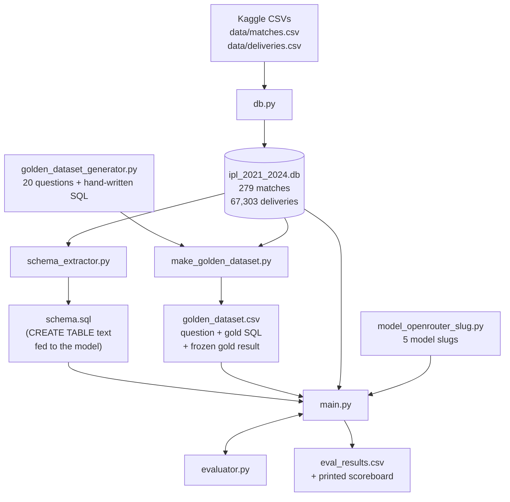
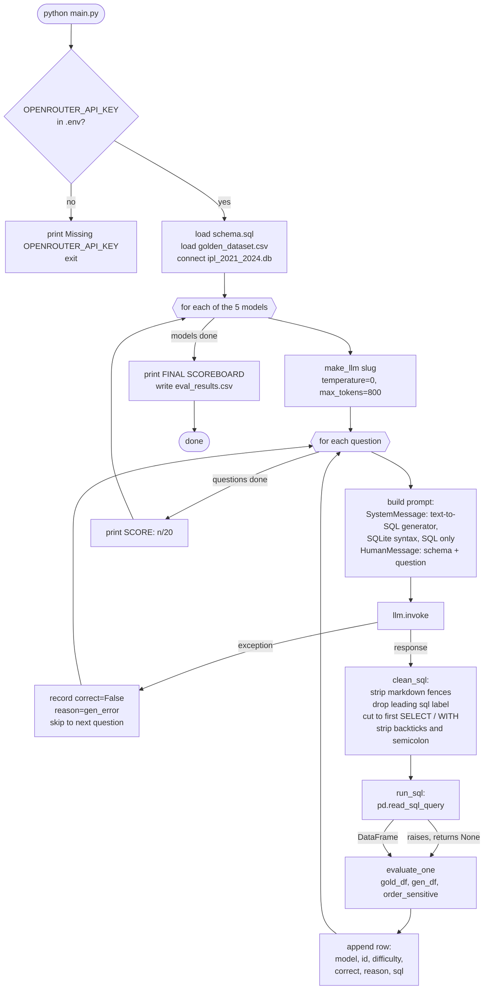
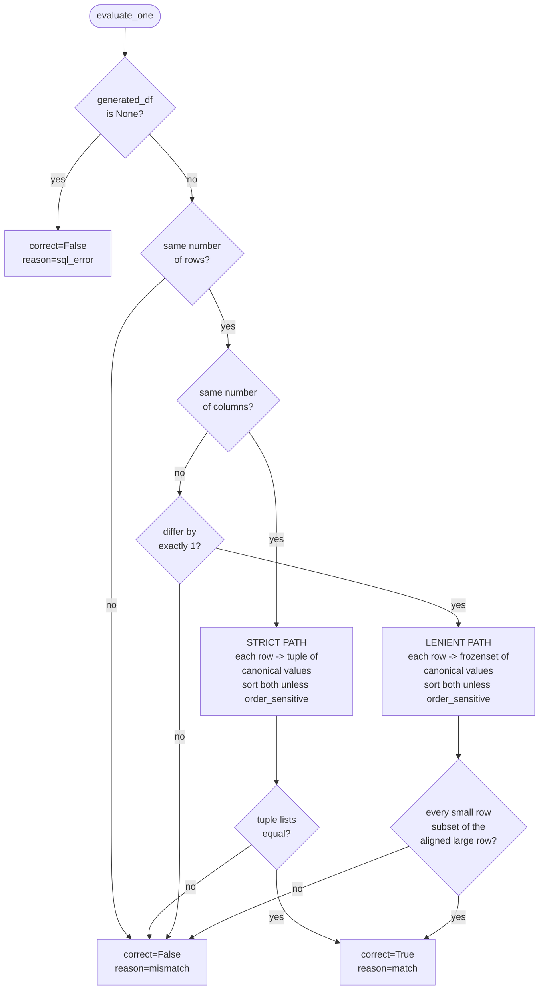

# Ask Cricinfo — Text-to-SQL Model Eval

An offline evaluation harness that answers one question:

> **Which LLM should power "Ask Cricinfo — Answers to Your Cricket Questions"?**

---

## 1. What we're actually doing

"Ask Cricinfo" lets a user type a plain-English cricket question and get a real
answer back:

> *"Who scored the most runs in 2024?"* → `SELECT batter, SUM(batsman_runs) …` → **Virat Kohli, 741**

The feature is **text-to-SQL**. The user's question never reaches a human — an LLM
translates it into SQL, we execute that SQL against the IPL database, and the rows
that come back are the answer. So the *only* thing that matters about the model is:

**does the SQL it writes return the same data as the SQL a cricket analyst would write?**

That is what this repo measures, and the metric is **execution accuracy** — we compare
query *results*, not query *text*. Two completely different-looking queries that return
the same rows are both correct.

### Why an eval at all

We had already shortlisted five candidate models against the product constraints:

| Constraint | Requirement |
| --- | --- |
| **Cost** | ≤ 5 Lac (500,000) |
| **Latency** | 2–3 s per question |
| **Rating** | Reputable / well-reviewed models only |

All five survivors clear cost, latency, and reputation. On paper they're
interchangeable — the spec sheet cannot tell them apart. Only accuracy on *our* schema
and *our* kind of question can, and that is unknowable without measuring it. Hence this
harness.

### The five models under test

Defined in `model_openrouter_slug.py`, all called through a single OpenRouter API key
so the code path is identical for every model:

| Display name | OpenRouter slug |
| --- | --- |
| GPT-5.6 Terra | `openai/gpt-5.6-terra-pro` |
| Kimi K3 | `moonshotai/kimi-k3` |
| Grok 4.5 | `x-ai/grok-4.5` |
| Claude Sonnet 5 | `anthropic/claude-sonnet-5` |
| MiniMax M3 | `minimax/minimax-m3` |

### The data

Kaggle's **IPL complete dataset** (`matches.csv` + `deliveries.csv`), filtered down to
seasons **2021–2024**. Place both CSVs in `data/` before you start.

Two tables, joined on `matches.id = deliveries.match_id`:

- **`matches`** — 279 rows. One row per match: teams, venue, toss, winner, margin.
- **`deliveries`** — 67,303 rows. One row per ball bowled: batter, bowler, runs,
  extras, wickets. This is where the interesting questions live.

---

## 2. Quick start

```bash
# 0. one-time setup
uv venv --python 3.13
uv pip install -r requirements.txt
source .venv/bin/activate

cp .env.example .env        # then put your real key in it
# .env  ->  OPENROUTER_API_KEY=sk-or-...

# 1. build the database from the Kaggle CSVs
python db.py

# 2. (optional) inspect the schema / regenerate schema.sql
python schema_extractor.py

# 3. (optional) smoke-test one question against one model
python first_test.py

# 4. run the full eval across all 5 models
python main.py
```

Steps 0 and 1 are required. Step 4 is the eval. Everything else is optional tooling.

**Only `main.py` and `first_test.py` need an API key** — they're the only scripts that
call a model. `db.py`, `schema_extractor.py`, and the golden-dataset scripts are
entirely offline.

---

## 3. The pipeline



The key idea: **the gold answer is frozen, not recomputed.** `make_golden_dataset.py`
runs each hand-written query once and stores the resulting rows as JSON inside
`golden_dataset.csv`. At eval time we compare the model's live result against that
frozen snapshot, so the benchmark can't drift under us.

---

## 4. What each file does

### Data layer

| File | Does | Reads | Writes |
| --- | --- | --- | --- |
| **`db.py`** | Builds the SQLite DB. Parses match dates (the `season` column is messy — `"2020/21"`, `"2009/10"` — so it filters on the parsed **date year**, not the season string), keeps 2021–2024, filters deliveries to those match IDs, adds indexes on `deliveries(match_id)` and `matches(id)`, then verifies row counts and checks for orphan deliveries. | `data/matches.csv`, `data/deliveries.csv` | `ipl_2021_2024.db` |
| **`schema_extractor.py`** | Prints each table's exact `CREATE TABLE` statement, its column inventory, row count, and 3 sample rows — then saves the DDL to disk. That saved file is what gets pasted into the model's prompt. Has a `RENAME = False` toggle that writes a de-memorized copy with renamed tables/columns (`matches`→`fixtures`, `batter`→`striker`, …) to test whether a model is leaning on memorized Kaggle column names rather than reading the schema. | `ipl_2021_2024.db` | `schema.sql` (and `ipl_eval.db` + `schema_renamed.sql` if `RENAME=True`) |

**Output of `db.py`:**

```
Matches in 2021-2024: 279
Deliveries for those matches: 67303

--- Verification ---
matches rows: 279
deliveries rows: 67303
orphan deliveries (should be 0): 0
date range: ('2021-04-09 00:00:00', '2024-05-26 00:00:00')

Done. Wrote ipl_2021_2024.db
```

### Benchmark layer

| File | Does | Reads | Writes |
| --- | --- | --- | --- |
| **`golden_dataset_generator.py`** | The question bank: 20 questions, each with a hand-written reference SQL query. Run it directly and it *validates* every gold query against the DB and prints a sample row. | `ipl_2021_2024.db` | nothing (exports the `GOLDEN` list) |
| **`make_golden_dataset.py`** | Executes every gold query, freezes the result rows as JSON, and writes the benchmark CSV. | `golden_dataset_generator.GOLDEN`, `ipl_2021_2024.db` | `golden_hard.csv` |
| **`model_openrouter_slug.py`** | Holds the 5 `(display_name, slug)` pairs. Run it directly to print the roster. | — | — |

**The question bank is deliberately brutal.** It is split by how many *traps* each
question compounds:

- **hard** (8 questions, 1–2 traps) — a ratio, a null-filter, a threshold, or a self-join
- **brutal** (12 questions, 3+ traps) — several of those stacked together

The traps are the things that actually separate models:

- **NULL-sensitive filtering** — `extras_type IS NULL OR extras_type NOT IN ('wides','noballs')`.
  Write `extras_type NOT IN (...)` alone and SQLite silently drops every normal ball,
  because `NULL NOT IN (...)` is `NULL`, not `TRUE`. This one trap kills a lot of answers.
- **Rates and ratios** — strike rate, economy, boundary %, batting average
- **`HAVING` thresholds** — "among batters with at least 500 runs"
- **Legal-ball counting** — excluding wides and no-balls correctly
- **Wicket attribution** — excluding run-outs from a bowler's wicket count
- **Multi-level subqueries / CTEs**
- **Self-referential team logic** — reasoning across `team1` / `team2` / `winner`
- **Innings and phase logic** — powerplay (overs 0–5), death overs (15–19)

Each benchmark row carries:

| Column | Meaning |
| --- | --- |
| `id` | question number |
| `difficulty` | `hard` or `brutal` |
| `question` | the plain-English question sent to the model |
| `gold_sql` | the reference query (for humans; never sent to the model) |
| `gold_result_json` | **the frozen correct answer** — `{"columns": [...], "rows": [[...]]}` |
| `n_rows` | how many rows the gold query returned |
| `order_sensitive` | `TRUE` if row order is part of correctness |

Only **one** question is order-sensitive — `#12`, *"For each season, which team scored
the most total runs? … ordered by season."* Everything else is compared as an unordered
set, because `LIMIT 1` questions and grouped aggregates have no meaningful row order.

### Eval layer

| File | Does | Reads | Writes |
| --- | --- | --- | --- |
| **`first_test.py`** | The smallest possible end-to-end check: one hard-coded question, one model, prints the raw unprocessed model output. Use it to confirm your key works and to see what the raw response actually looks like before cleaning. | `schema.sql`, `.env` | stdout only |
| **`main.py`** | The orchestrator. Loops every model × every question, generates SQL, executes it, scores it, prints a scoreboard. | `schema.sql`, `golden_dataset.csv`, `ipl_2021_2024.db`, `.env` | `eval_results.csv` |
| **`evaluator.py`** | The scoring logic — pure functions, no I/O, no network. Kept separate from `main.py` so the comparison rules can be changed and unit-tested without touching orchestration. | — | — |

---

## 5. `main.py` — the eval flow



### Why `clean_sql` exists

Models ignore "return only the SQL" constantly. They wrap answers in fences, prefix
them with `sql`, or add a sentence of explanation first. `clean_sql` normalises all of
that down to something executable:

Raw model output:

````text
Here is the query you asked for:

```sql
SELECT batter, SUM(batsman_runs) FROM deliveries GROUP BY batter;
```
````

After `clean_sql`:

```sql
SELECT batter, SUM(batsman_runs) FROM deliveries GROUP BY batter
```

It strips the fence, then cuts everything before the first `SELECT` or `WITH` (which
removes any prose preamble), then strips stray backticks and the trailing semicolon.
Without this step, formatting preference would be scored as SQL incompetence.

### The three failure modes

`eval_results.csv` records a `reason` per question, so failures are diagnosable rather
than just "wrong":

| `reason` | What happened | Whose fault |
| --- | --- | --- |
| `gen_error` | The API call itself threw — bad slug, no credits, rate limit, timeout | Infrastructure, **not the model's SQL** |
| `sql_error` | Model returned SQL, but SQLite refused to run it | Model — invalid SQL |
| `mismatch` | SQL ran fine, returned the wrong data | Model — wrong logic |
| `match` | Correct | — |

Keeping `gen_error` distinct matters: a model showing 0/20 with 20 `gen_error`s has not
been evaluated at all, it just never got called successfully. Always check the `reason`
column before reading the scoreboard.

**Output of `main.py`:**

```
============================================================
MODEL: GPT-5.6 Terra  (openai/gpt-5.6-terra-pro)
============================================================
  # 1 [hard  ] OK  match
  # 2 [hard  ] XX  mismatch
  # 3 [hard  ] XX  sql_error
  ...

  SCORE: 8/20 = 40.0%

============================================================
FINAL SCOREBOARD (execution accuracy)
============================================================
  GPT-5.6 Terra       8/20  =  40.0%
  Kimi K3             0/20  =   0.0%
  ...

Detailed results saved -> eval_results.csv
```

---

## 6. `evaluator.py` — how comparison works

This is the heart of the eval, so it's worth understanding precisely.

We are comparing two result sets: the **gold** rows (frozen in the CSV) and the
**generated** rows (whatever the model's SQL just returned). We want to be strict about
the *data* and forgiving about *presentation*.

### What's forgiven vs. what isn't

| Forgiven | Enforced |
| --- | --- |
| Column **names** (`legal_balls` vs `ball_count`) | Row **count** must match exactly |
| Column **order** within a row | The **values** must match |
| Number **type** (`1391` vs `1391.0`) | Column count may differ by **at most 1** |
| Float noise beyond 4 decimal places | Row order, **when `order_sensitive=TRUE`** |
| Row order (by default) | |
| One **extra or missing** column | |

### The flow



### Step 1 — canonicalise every cell

Before anything is compared, each cell is normalised by `_canon_cell` so that values
that *mean* the same thing *look* the same:

| Raw value | Canonical form | Why |
| --- | --- | --- |
| `1391` (int) | `num:1391` | |
| `1391.0` (float) | `num:1391` | SQLite `COUNT` vs `SUM` return different types |
| `"1391"` (string) | `num:1391` | strings that parse as numbers are treated as numbers |
| `33.333333333` | `num:33.3333` | rounded to 4dp, so float noise doesn't fail a correct answer |
| `"YS Chahal"` | `str:YS Chahal` | whitespace stripped |
| `None` / `NaN` | `∅` | NULL is a value, and must compare equal to NULL |
| `True` | `str:True` | bools kept distinct from `1` |

This is why a model that writes `COUNT(*) * 1.0` instead of `COUNT(*)` isn't punished.

### Step 2 — pick a path

**Strict path** (same column count): each row becomes an ordered **tuple** of canonical
values. Both lists are sorted unless `order_sensitive=TRUE`, then compared for equality.
Position matters here, so a model that swaps two columns fails — which is correct, since
with equal column counts there is no ambiguity about intent.

**Lenient path** (column counts differ by exactly 1): each row becomes a **frozenset**
of its values, dropping position entirely, and we require every row of the smaller
result to be a subset of the aligned row of the larger one.

### Why the lenient path exists

Ask *"Which bowler bowled the most legal deliveries?"* and you get two equally correct
shapes back:

```
Model A:  YS Chahal              -- just the name
Model B:  YS Chahal | 1391       -- name and count
```

Both answer the question. Penalising Model A for being terse would measure formatting
compliance, not SQL skill. So a difference of exactly one column is tolerated. A
difference of two or more is not — at that point the model is answering a different
question.

### Worked examples

**Example 1 — numeric type mismatch → MATCH**

```
Question:   Which bowler bowled the most legal deliveries?
Gold:       columns ["bowler", "legal_balls"],  rows [["YS Chahal", 1391]]
Generated:  columns ["bowler", "ball_count"],   rows [["YS Chahal", 1391.0]]
```

Rows: 1 = 1. Columns: 2 = 2 → **strict path**.
Canonical gold: `("str:YS Chahal", "num:1391")`
Canonical generated: `("str:YS Chahal", "num:1391")`
Column names were never looked at; `1391.0` collapsed to `num:1391`. → **`match`**

**Example 2 — model omits the count column → MATCH**

```
Gold:       [["YS Chahal", 1391]]        (2 columns)
Generated:  [["YS Chahal"]]              (1 column)
```

Rows: 1 = 1. Columns differ by exactly 1 → **lenient path**.
Small row: `{"str:YS Chahal"}`
Large row: `{"str:YS Chahal", "num:1391"}`
`{"str:YS Chahal"} ⊆ {"str:YS Chahal", "num:1391"}` → **`match`**

**Example 3 — row order ignored by default → MATCH**

```
Gold:       [["Chahal", 96], ["Bumrah", 89]]
Generated:  [["Bumrah", 89], ["Chahal", 96]]
```

`order_sensitive` is `FALSE`, so both lists are sorted before comparison and they
become identical. → **`match`**

**Example 4 — same rows, but order-sensitive question → MISMATCH**

```
Question #12:  "... one row per season, ordered by season."   order_sensitive = TRUE
Gold:       [[2021,"CSK",2100], [2022,"GT",2200], [2023,"CSK",2300], [2024,"KKR",2400]]
Generated:  [[2024,"KKR",2400], [2023,"CSK",2300], [2022,"GT",2200], [2021,"CSK",2100]]
```

The sort step is skipped, so position matters and the tuples don't line up. The model
got the data right but ignored the explicit `ORDER BY season` the question asked for.
→ **`mismatch`**

**Example 5 — the NULL trap → MISMATCH**

```
Gold SQL:   WHERE extras_type IS NULL OR extras_type NOT IN ('wides','noballs')
Model SQL:  WHERE extras_type NOT IN ('wides','noballs')

Gold:       [["YS Chahal", 1391]]
Generated:  [["R Ashwin", 43]]
```

The model's filter silently discarded every normal delivery, because `extras_type` is
`NULL` on normal balls and `NULL NOT IN (...)` evaluates to `NULL`, not `TRUE`. The SQL
ran without error — it was just quietly wrong. Rows: 1 = 1, columns: 2 = 2, but the
values differ. → **`mismatch`**

This is exactly the class of bug execution accuracy is designed to catch and text
similarity is not: the two queries differ by six characters and produce completely
different answers.

**Example 6 — invalid SQL → SQL_ERROR**

```
Model SQL:  SELECT batter, SUM(runs_scored) FROM deliveries GROUP BY batter
```

There's no `runs_scored` column (it's `batsman_runs`), so `pd.read_sql_query` raises,
`run_sql` returns `None`, and `evaluate_one` short-circuits. → **`sql_error`**

### Known limits of this scoring

Worth being honest about, since they set the ceiling on what the numbers mean:

- **The lenient path can't check the omitted column.** If a model returns only
  `["YS Chahal"]`, we score it correct without ever verifying its count was right. The
  name is treated as sufficient evidence.
- **`frozenset` collapses duplicate values within a row.** A row like
  `["Mumbai Indians", 200, 200]` becomes a 3-element tuple on the strict path but only a
  2-element set on the lenient path. Only affects rows with repeated values.
- **Row counts must match exactly**, so a model that returns the top 3 for a `LIMIT 1`
  question fails immediately — before any values are compared.

---

## 7. Interpreting `eval_results.csv`

One row per (model, question):

| Column | Meaning |
| --- | --- |
| `model` | display name |
| `id` | question id |
| `difficulty` | `hard` / `brutal` |
| `correct` | `True` / `False` |
| `reason` | `match` / `mismatch` / `sql_error` / `gen_error` |
| `sql` | the cleaned SQL the model produced (empty on `gen_error`) |

Useful slices:

```python
import pandas as pd
r = pd.read_csv("eval_results.csv")

r.groupby("model")["correct"].mean()                    # accuracy per model
r.groupby(["model", "difficulty"])["correct"].mean()    # hard vs brutal
r["reason"].value_counts()                              # is it wrong, or did it not run?
r[r.reason == "mismatch"][["model", "id", "sql"]]       # read the actual bad SQL
```

That last one is where the real insight is. The scoreboard tells you *which* model to
pick; the `sql` column tells you *why* — and usually points at a prompt fix (spell out
the NULL-handling rule, say) that lifts every model at once.

> **Note on the checked-in `eval_results.csv`:** in the recorded run, 89 of 100
> attempts came back as `gen_error` — the API calls never completed, so those models
> were not actually measured. Only `GPT-5.6 Terra` (8/20) and `MiniMax M3` (3/20)
> produced usable data. Treat that file as a format sample, not as a result, and re-run
> `main.py` with a funded key before drawing any conclusion.

---

## 8. Things to know before you change anything

- **`golden_dataset.csv` is the 20-question hard set.** It matches
  `golden_dataset_generator.GOLDEN` exactly (8 `hard` + 12 `brutal`). Some docstrings
  still refer to a separate 30-question set — that's stale; there is only one bank.
- **`make_golden_dataset.py` writes `golden_hard.csv`, but `main.py` reads
  `golden_dataset.csv`.** Regenerating the benchmark therefore does *not* update what
  the eval actually runs. Copy the file across deliberately:
  `python make_golden_dataset.py && cp golden_hard.csv golden_dataset.csv`
- **Rebuild order matters.** Change the DB → re-run `schema_extractor.py` (schema text)
  *and* `make_golden_dataset.py` (frozen gold results). Stale gold against a fresh DB
  will fail every model for the wrong reason.
- **`max_tokens=800`** in `make_llm` is deliberate — SQL is short, and a low reservation
  avoids OpenRouter credit-reservation errors. Raise it only if you see truncated SQL.
- **`temperature=0`** everywhere, so runs are as reproducible as the providers allow.
- **`.env` and `.venv` are gitignored.** Never commit the key.
- **Adding a model** is one line in `model_openrouter_slug.py`. Nothing else changes.
- **Adding a question** means appending to `GOLDEN` in `golden_dataset_generator.py`,
  running that file to validate the SQL executes, then regenerating the CSV.

---

## 9. Requirements

Python 3.13 (3.10+ works). From `requirements.txt`:

| Package | Used by |
| --- | --- |
| `pandas` | `db.py`, `schema_extractor.py`, `main.py`, `evaluator.py` |
| `python-dotenv` | `main.py`, `first_test.py` — loads `OPENROUTER_API_KEY` |
| `langchain-openrouter` | `main.py`, `first_test.py` — `ChatOpenRouter` |
| `langchain-core` | `main.py`, `first_test.py` — `SystemMessage`, `HumanMessage` |

`sqlite3`, `csv`, `json`, and `re` are standard library.
